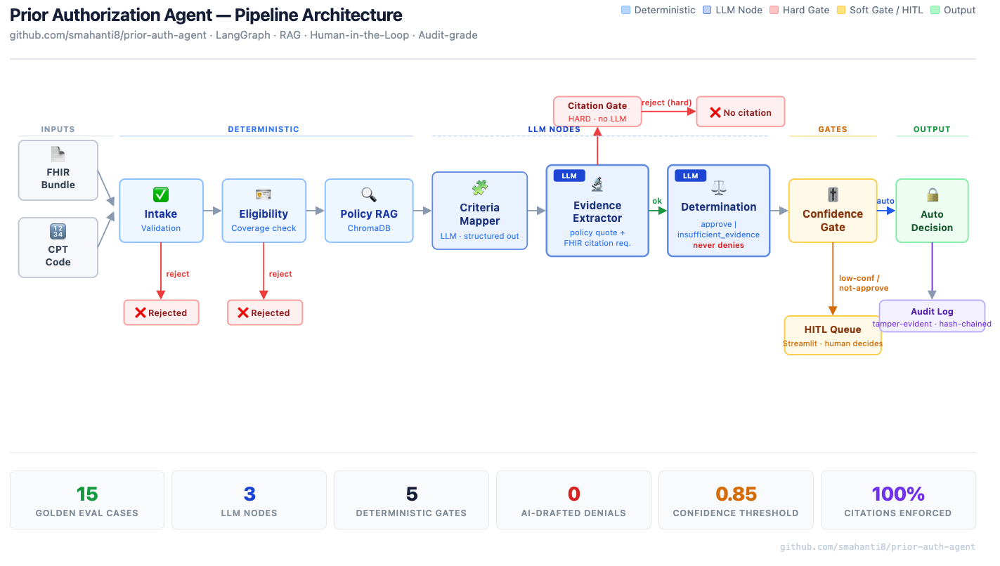

# Healthcare Prior Auth Agent

[](https://github.com/smahanti8/prior-auth-agent/actions/workflows/golden_eval.yml)

An agentic prior-authorization pipeline: it takes a FHIR bundle and a CPT code, validates and checks eligibility, retrieves the applicable payer policy via RAG (ChromaDB), maps policy criteria, and extracts per-criterion clinical evidence with citations. It drafts either an approval or an `insufficient_evidence` result — it never drafts a denial, because a drafted denial anchors the reviewer; a human makes any adverse decision. A hard citation gate rejects any criterion marked *met* that lacks both a policy-side quote and a chart-side FHIR citation ("no citation → no claim"), and non-approved or low-confidence cases route to a human review queue (Streamlit). Every decision is written to a tamper-evident, hash-chained audit log.

**[▶ Live Interactive Demo](https://smahanti8.github.io/prior-auth-agent/)** &nbsp;·&nbsp; [Architecture decisions](DECISIONS.md)

## Architecture



```
FHIR Bundle ─┐
             ├─> Intake ─> Eligibility ─> Policy RAG (ChromaDB) ─> Criteria Mapper
CPT Code  ───┘      │          │                                        │
                 reject      reject                                      v
                                            Evidence Extractor (policy quote + chart citations)
                                                              │
                              Citation Gate ──"met" claim missing a quote──> reject (hard)
                                                              │ ok
                              Determination (approve | insufficient_evidence — never denies)
                                                              │
                              Confidence Gate ──not-approve / low-confidence──> HITL Queue (Streamlit)
                                                              │ auto (approvals only)
                                                       Auto Decision
                                                              │
                                         tamper-evident, hash-chained audit log
```

## Layout

```
src/prior_auth_agent/
├── config.py              # env, model id, confidence threshold
├── state.py               # LangGraph state schema
├── graph.py               # graph wiring + entrypoint
├── llm.py                 # shared Anthropic client + structured-output helper (streamed)
├── validation.py          # pydantic citation rule: no citation -> no claim
├── nodes/
│   ├── intake.py          # FHIR bundle + CPT validation
│   ├── eligibility.py     # coverage / eligibility check (stub for payer API)
│   ├── policy_rag.py      # ChromaDB retrieval of applicable policy chunks
│   ├── criteria_mapper.py # policy text -> discrete, checkable criteria
│   ├── evidence_extractor.py  # per-criterion evidence w/ policy quote + FHIR citations
│   ├── citation_gate.py   # hard reject: any met claim missing a policy or chart quote
│   ├── determination.py   # draft approve | insufficient_evidence + rationale (never denies)
│   └── confidence_gate.py # routes approvals to auto decision, everything else to HITL
├── vectorstore/
│   ├── store.py           # ChromaDB persistent client + collection
│   └── ingest.py          # chunk & index policy documents
└── hitl/
    └── review_app.py      # Streamlit review queue UI
```

## Quickstart

```bash
# 1. Install (Python 3.11+)
pip install -e .

# 2. Credentials
cp .env.example .env       # set ANTHROPIC_API_KEY (or use `ant auth login`)

# 3. Index payer policies (drop .md/.txt policy docs into data/policies/)
python -m prior_auth_agent.vectorstore.ingest

# 4. Run the agent on the sample case
python -m prior_auth_agent.graph data/samples/sample_bundle.json 29881

# 5. Review non-approved cases
streamlit run src/prior_auth_agent/hitl/review_app.py
```

The deterministic parts (intake, eligibility, the citation gate, the audit log) are covered by the test suite and need **no** API key: `PYTHONPATH=src python -m pytest tests/ -q`.

## Notes

- **Model**: `claude-opus-4-8` with adaptive thinking; structured outputs (`output_config.format`) guarantee schema-valid JSON at every LLM node. Calls are streamed, as the SDK requires above its non-streaming time ceiling.
- **No AI-drafted denials**: the determination schema can only emit `approve` or `insufficient_evidence`; a denial is made by a human in the review queue, never framed by the model.
- **Citation gate**: a criterion marked *met* must carry both a policy-side quote and a chart-side FHIR citation, or it is rejected outright — a hard gate, separate from the confidence gate's soft routing.
- **Design decisions**: the never-deny rule is [DECISIONS.md](DECISIONS.md) D9; the bilateral-citation gate is D10, which extends D2 (citations must be present; existence-against-the-bundle is still unverified).
- **Confidence gate**: non-approvals, cases below `CONFIDENCE_THRESHOLD` (default 0.85), or any required criterion lacking evidence go to `data/review_queue/pending.jsonl` for human review.
- **PHI**: this scaffold does no de-identification; do not point it at real patient data without your compliance controls in place.

## Unit Economics

Per-node token counts, latency, and cost — averaged across the 13 LLM golden-set
cases. Populate by running:

```bash
python -m evals.run --live        # record cassettes (burns API once)
python -m evals.cost_report       # replay cassettes, print table
```

| Node | Type | Tokens (in / out) | Latency p50 | Cost / det | Note |
|------|------|-------------------|-------------|------------|------|
| intake | deterministic | — | ~2 ms | $0.0000 | FHIR validation |
| eligibility | deterministic | — | ~1 ms | $0.0000 | Coverage status check |
| policy_rag | deterministic | — | ~18 ms | $0.0000 | ChromaDB retrieval |
| **criteria_mapper** | **LLM** | [run] / [run] | [run] | **[run]** | Policy → criteria list |
| **evidence_extractor** | **LLM** | [run] / [run] | [run] | **[run]** | Per-criterion evidence (32k budget) |
| citation_gate | deterministic | — | ~1 ms | $0.0000 | Hard citation existence check |
| **determination** | **LLM** | [run] / [run] | [run] | **[run]** | Approve / insufficient_evidence |
| confidence_gate | deterministic | — | <1 ms | $0.0000 | Route: auto vs HITL |
| **TOTAL** | | [run] / [run] | [run] | **[run]** | |

*Model: claude-opus-4-8. Numbers require a live run — `[run]` will be replaced
by `python -m evals.cost_report` output.*

Monthly projection and model tiering table (which nodes could run on Haiku, what
that saves at 1M/month, and whether golden-set accuracy drops) are generated by:

```bash
python -m evals.tier_analysis --live --tier haiku   # all three LLM nodes
```

See [EVALS.md](EVALS.md) for methodology and known limitations.

## Eval Suite

A 15-case golden eval suite scores four dimensions per case: determination
accuracy, routing accuracy, criterion-level evidence accuracy (catches
"right answer, wrong reason"), and citation validity. Cassette-based replay
means CI runs at zero API cost.

See [EVALS.md](EVALS.md) for methodology, metric definitions, case index,
scoreboard, and an explicit limitations section.

```bash
# Record cassettes once (requires ANTHROPIC_API_KEY)
python -m evals.run --live

# Replay in CI (no API key)
python -m evals.run --baseline-check
```

## What Changes Inside a PHI Boundary

> The `infra/` directory contains documentation-grade Terraform — a reference
> architecture showing the compliance reasoning, not a provisioned production system.
> All account IDs, ARNs, and region values are placeholders. See `infra/README.md`.

### The default path does not satisfy a BAA

`LLM_BACKEND=anthropic` (the default) routes model calls to the direct Anthropic API,
which is not covered under a Business Associate Agreement (BAA) for PHI. Patient data
in prompts would travel to Anthropic infrastructure under commercial terms, not a
healthcare data-processing agreement. **Do not point this pipeline at real patient data
without your compliance controls in place.**

### The Bedrock path and what it buys

`LLM_BACKEND=bedrock` routes all model calls through your AWS account via Amazon
Bedrock. AWS BAA programs can cover Bedrock usage. PHI in prompts stays within your
AWS compliance perimeter — the model is still Claude, but running on AWS infrastructure
under your agreement with AWS.

The switch is one environment variable. Internally, `llm.py` constructs
`anthropic.AnthropicBedrock()` instead of `anthropic.Anthropic()`, and the task IAM
role supplies credentials — no `ANTHROPIC_API_KEY` is injected. The Bedrock client is
the same Anthropic Python SDK; `structured_call()` is unchanged except the model ID
parameter changes to Bedrock's ARN-format string.

**Known gap:** `output_config.format` (the JSON schema constraint used at every LLM
node) is an Anthropic-platform API extension. Verify its availability on Bedrock before
using `LLM_BACKEND=bedrock` in production; if unavailable, the structured-output
constraint must be re-implemented via the `tools` API on the Bedrock path. Extended
thinking (`thinking: {type: adaptive}`) is supported on Bedrock.

### What must never enter logs or error traces

The audit log records metadata only — `user_id`, `tokens_used`, `artifact_type`,
`criteria_versions` — per the project security rules. Two additional constraints apply
at the PHI boundary:

1. **CloudWatch log group** (`/ecs/prior-auth-agent`): error traces from
   `evidence_extractor` and `determination` may contain FHIR bundle fragments.
   A log processor or CloudWatch metric filter must redact PHI fields before
   retention. Raw bundle content must never persist in a log group.

2. **HTTP error responses**: FastAPI exception handlers must not echo raw bundle
   content in 422/500 responses. Return a case ID; not the data.

PHI-adjacent fields: patient name, DOB, MRN, diagnosis code combinations, and
medication + diagnosis together — re-identifiable by combination even without a name.

### Key custody

The KMS key in `infra/kms.tf` is a customer-managed key (CMK), not `aws/s3`. With
`aws/s3`, AWS controls key material access; with a CMK, the customer owns the key
policy and AWS cannot access customer-managed key material.

The key policy separates admin from user:
- **Key admin role**: can manage key lifecycle (rotate, disable, schedule deletion)
  but cannot use the key for data operations.
- **Task role** (the running container): can encrypt and decrypt audit log objects
  but cannot manage, rotate, or disable the key.

This prevents a compromised container from disabling its own audit trail.

### Audit retention obligations

HIPAA requires audit log retention for 6 years. The S3 bucket uses object lock in
**COMPLIANCE** mode with a 7-year default (`audit_retention_days = 2556`).

GOVERNANCE mode allows privileged IAM users to override retention. COMPLIANCE mode
makes the retention floor unoverridable by any IAM principal, including root — this
is the right setting for records that back clinical determinations and extend the
tamper-evident guarantee from DECISIONS.md D7/D8 to the storage layer.

### Network boundary

All ECS tasks run in private subnets with no public IP. VPC endpoints for ECR
(image pull), S3 (audit writes), Bedrock (model calls), and CloudWatch Logs mean
production data for those services stays within the AWS network and never traverses
the NAT gateway. Inbound FHIR bundles enter through an ALB in public subnets with
TLS termination; the ECS service is not reachable from the internet directly.

### Cost delta of the compliant path

Bedrock pricing is comparable to the direct Anthropic API but includes a per-request
markup (rate varies by model and region — verify current Bedrock pricing before
projecting). Per-node telemetry (`telemetry.py`) captures cost per determination
per node. Adding Bedrock model IDs to `_PRICING` makes the delta visible at per-node
resolution; the Bedrock prefix entries are already in the table for the cross-region
inference IDs (`us.anthropic.*`).

Infrastructure cost adds: NAT gateway data processing, VPC interface endpoints
(5 × ~$0.01/hr per AZ), Fargate vCPU/memory hours, ALB. At the scale this pipeline
targets, the infrastructure cost is dominated by Fargate compute, not API pricing.

## Known Limitations

1. **LLM node coverage comes from a 15-case golden eval suite, not exhaustive unit tests.** Cassette-based replay (`evals/run.py`) lets criteria mapping, evidence extraction, and determination run in CI without an API key — see [EVALS.md](EVALS.md) for what that suite does and doesn't validate.
2. **Eligibility is a stub.** It reads `Coverage.status` from the bundle and nothing more; it does not perform a real 270/271 eligibility transaction or call a payer coverage API.
3. **The audit log is tamper-evident, not tamper-proof.** The hash chain detects edits, deletions, and reordering, but an attacker who can rewrite the whole file can rebuild the chain. Anchoring the head hash externally is not yet implemented.
4. **RAG retrieval can select the wrong policy document.** The query's only reliably distinguishing feature between similar policies is the numeric CPT code; the local embedding model (all-MiniLM-L6-v2) doesn't always weight that distinctly enough against near-identical boilerplate shared across policy documents. Confirmed via a live eval run: 3 of 5 test CPTs retrieved a different policy's chunks as the top match. Not yet fixed.
5. **Empty criteria can vacuously auto-approve.** When retrieval returns zero applicable policy chunks (e.g., no policy exists for the requested CPT), the determination step can reason "no required criteria to evaluate" as trivially satisfied and approve, rather than treating the absence of any policy knowledge as insufficient. Confirmed via `case_008`'s live eval run. Not yet fixed.

**Fixed 2026-08-02:** the policy chunker in `ingest.py` previously crawled forward one character at a time whenever a paragraph break fell within the overlap window — up to ~200 near-duplicate chunks from a ~1KB document. Not just wasteful: once more than one policy existed in the same ChromaDB collection, the resulting dense cluster could dominate retrieval for every query, regardless of the actual CPT. See `tests/test_ingest.py`.
